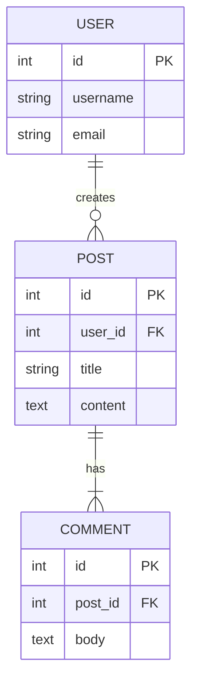

# Schema3D

A 3D database schema visualization tool that renders database tables as interactive 3D objects, connected by relationship lines showing foreign key constraints. Built with React, Three.js, and TypeScript.

  

**🌐 [Live Demo](https://schema3d.com)** | [Documentation](#getting-started) | [Contributing](CONTRIBUTING.md)

## Features

### 🎨 Interactive 3D Visualization

- **3D Table Rendering**: Tables displayed as color-coded 3D boxes by category
- **Relationship Lines**: Visual connections showing foreign key relationships with PK/FK notation
- **Interactive Controls**: Rotate, zoom, and pan the camera to explore your schema
- **Hover & Selection**: Hover effects and click-to-select tables and relationships
- **Visual Feedback**: Highlighted tables and relationships with smooth animations

### 📊 Schema Management

- **Multiple Sample Schemas**: Pre-configured schemas (Retailer Database, Blog Platform, University)
- **Dual Format Support**: Import schemas via SQL CREATE TABLE statements or Mermaid ER diagrams
- **Format Auto-Detection**: Automatically detects SQL or Mermaid format when pasting schema text
- **Live Syntax Validation**: Real-time validation of SQL and Mermaid input with error feedback
- **Schema Switching**: Easily switch between different database schemas

### 🎯 Layout Algorithms

- **Circular Layout**: Distributes tables evenly around a circle
- **Force-Directed Layout**: Physics-based positioning based on relationship strength
- **Hierarchical Layout**: Organizes tables in layers based on dependencies

### 🔍 Search & Filter

- **Real-time Search**: Search across table and column names
- **Smart Highlighting**: Highlights matched tables and related connections
- **Focus Mode**: Dims non-matched tables for better focus

### 🏷️ Category Management

- **Dynamic Filtering**: Toggle visibility of specific table categories via the interactive legend
- **Custom Categories**: Create, rename, and delete categories to organize your schema
- **Color Customization**: Assign custom colors to categories for better visual distinction
- **Table Organization**: Easily move tables between categories using the category editor
- **Auto-Assignment**: New categories are automatically assigned distinct colors

### 📤 Export Functionality

- **PNG Screenshots**: Export your visualization as a high-quality image
- **GLTF Export**: Export the entire 3D scene for use in other applications

### Sharing & Collaboration

- **Shareable URLs**: Generate compressed URLs that encode both your schema and view state
- **URL size limits**: Very large schemas may exceed browser URL length limits; sharing works best with moderately sized schemas
- **View State Preservation**: Shared links preserve selected categories, layout algorithm, and view mode
- **One-Click Sharing**: Copy shareable links to clipboard with a single click
- **Format Support**: Compatible with SQL and Mermaid schema formats
- **Backward Compatible**: New URLs work in older versions, gracefully degrading if view state isn't supported

### Additional Features

- **Table Details Panel**: Click tables to view detailed column information
- **Relationship Details Panel**: Click relationship lines to view FK/PK details
- **Responsive UI**: Modern, accessible interface built with Radix UI and Tailwind CSS

## Getting Started

### Prerequisites

- Node.js 20+
- npm or yarn

### Installation

1. Clone the repository:

```bash
git clone <repository-url>
cd Schema3D
```

2. Install dependencies:

```bash
npm install
```

3. Start the development server:

```bash
npm run dev
```

4. Open your browser to `http://localhost:3000`

### Building for Production

```bash
npm run build
npm start
```

The production build will be available in the `dist` directory.

### Testing Production Build Locally

To test the production build locally before deploying:

1. **Build the project:**

   ```bash
   npm run build
   ```

   This will:
   - Build the client with Vite (outputs to `dist/public`)
   - Bundle the server with esbuild (outputs to `dist/index.js`)

2. **Start the production server:**

   ```bash
   npm start
   ```

   This starts the production server on port 3000 (or the PORT environment variable if set).

3. **Open your browser:**
   Navigate to `http://localhost:3000`

4. **Verify it's working:**
   - The app should load without any development tools
   - Check the browser console for any errors
   - Test all features (schema switching, table selection, etc.)

**Note:** The production build serves static files from `dist/public` and runs the bundled server from `dist/index.js`. Make sure both are generated successfully during the build process.

## Deployment

### Vercel Deployment

This app is configured for Vercel deployment. The `vercel.json` configuration:

- Builds the client with Vite
- Serves static files from `dist/public`
- Handles client-side routing with rewrites

**Deploy to Vercel:**

1. Push your code to GitHub/GitLab/Bitbucket
2. Import the project in Vercel
3. Vercel will automatically detect the configuration and deploy

**Note:** Since this is a client-side only app, the Express server code is not used in Vercel deployment. The app runs entirely in the browser.

### Other Deployment Platforms

For platforms that support Node.js servers (Railway, Render, Heroku, etc.):

1. Build the project: `npm run build`
2. Start the server: `npm start`
3. The server will serve static files from `dist/public` and handle routing

## Project Structure

```
Schema3D/
├── client/                      # Frontend React application
│   ├── src/
│   │   ├── app/                # App-level configuration
│   │   │   ├── App.tsx         # Main app component with routing
│   │   │   └── main.tsx        # Application entry point
│   │   │
│   │   ├── schemas/            # Schema parsing and format conversion
│   │   │   ├── parsers/        # SQL and Mermaid parsers (format-agnostic)
│   │   │   │   ├── sql-parser.ts
│   │   │   │   ├── mermaid-parser.ts
│   │   │   │   ├── parser-utils.ts
│   │   │   │   ├── parsers.ts
│   │   │   │   └── index.ts
│   │   │   ├── utils/          # Schema format utilities
│   │   │   │   ├── schema-converter.ts
│   │   │   │   ├── load-schemas.ts
│   │   │   │   └── index.ts
│   │   │   ├── sample-schemas/ # Sample schema files
│   │   │   │   ├── retailer.sql
│   │   │   │   ├── blog-platform.sql
│   │   │   │   └── university.mmd
│   │   │   └── index.ts
│   │   │
│   │   ├── visualizer/         # Visualization domain
│   │   │   ├── state/          # Visualization state management
│   │   │   │   ├── hooks/      # State management hooks
│   │   │   │   │   ├── use-schema-state.ts
│   │   │   │   │   ├── use-selection-state.ts
│   │   │   │   │   ├── use-filter-state.ts
│   │   │   │   │   ├── use-url-schema.ts          # URL schema loading
│   │   │   │   │   └── use-collect-view-state.ts  # View state collection
│   │   │   │   ├── utils/      # State utilities
│   │   │   │   │   ├── schema-utils.ts      # Layout, selections, comparisons
│   │   │   │   │   ├── schema-state-utils.ts
│   │   │   │   │   └── view-state-store.ts  # View state temporary storage
│   │   │   │   │   └── schema-state-utils.ts # Category management
│   │   │   │   └── types.ts
│   │   │   ├── 3d/             # 3D visualization components
│   │   │   │   ├── components/ # 3D scene components
│   │   │   │   │   ├── relationships/
│   │   │   │   │   │   ├── cardinality.tsx
│   │   │   │   │   │   ├── relationship-lines.tsx
│   │   │   │   │   │   └── relationship-utils.ts
│   │   │   │   │   ├── tables/
│   │   │   │   │   │   ├── table-3d.tsx
│   │   │   │   │   │   └── table-utils.ts
│   │   │   │   │   ├── schema-scene.tsx
│   │   │   │   │   └── schema-visualizer.tsx
│   │   │   │   ├── controls/   # 3D camera controls
│   │   │   │   │   └── camera-controller.tsx
│   │   │   │   ├── hooks/      # 3D-specific hooks
│   │   │   │   │   ├── use-table-animation.ts
│   │   │   │   │   ├── use-layout-management.ts
│   │   │   │   │   ├── use-camera-controls.ts
│   │   │   │   │   └── use-interaction-handlers.ts
│   │   │   │   ├── utils/      # 3D visualization utilities
│   │   │   │   │   ├── camera-utils.ts
│   │   │   │   │   ├── layout-algorithm.ts
│   │   │   │   │   └── layout-utils.ts
│   │   │   │   ├── constants.ts
│   │   │   │   ├── types.ts
│   │   │   │   └── index.ts
│   │   │   │
│   │   │   └── ui/             # UI components for visualizer
│   │   │       ├── layout/     # Layout and category controls
│   │   │       │   ├── layout-controls.tsx
│   │   │       │   ├── category-legend.tsx
│   │   │       │   └── category-edit-dialog.tsx
│   │   │       ├── schema/     # Schema-related UI components
│   │   │       │   ├── schema-controls.tsx
│   │   │       │   ├── schema-editor.tsx
│   │   │       │   ├── format-selector.tsx
│   │   │       │   ├── file-upload-button.tsx
│   │   │       │   ├── sample-schema-selector.tsx
│   │   │       │   └── share-button.tsx       # Shareable URL generation
│   │   │       ├── panels/     # Information panels
│   │   │       │   ├── panel.tsx
│   │   │       │   ├── table-info.tsx
│   │   │       │   └── relationship-info.tsx
│   │   │       ├── export/      # Export functionality
│   │   │       │   ├── export-controls.tsx
│   │   │       │   └── export-utils.ts
│   │   │       ├── search/     # Search/filter functionality
│   │   │       │   └── search-filter.tsx
│   │   │       └── schema-overlay.tsx # Main UI overlay component
│   │   │
│   │   ├── shared/             # Shared across domains
│   │   │   ├── ui-components/  # Base UI components (Radix UI wrappers)
│   │   │   │   ├── button.tsx
│   │   │   │   ├── card.tsx
│   │   │   │   ├── dialog.tsx
│   │   │   │   ├── input.tsx
│   │   │   │   ├── toggle-group.tsx
│   │   │   │   ├── toast.tsx
│   │   │   │   └── ...         # Other UI components
│   │   │   ├── hooks/          # Shared React hooks
│   │   │   │   └── use-is-mobile.tsx
│   │   │   ├── utils/          # Shared utilities
│   │   │   │   ├── button-styles.ts
│   │   │   │   ├── url-encoding.ts    # Schema and view state encoding/decoding
│   │   │   │   ├── url-state.ts       # URL hash management
│   │   │   │   └── utils.ts
│   │   │   ├── types/          # Shared TypeScript types
│   │   │   │   └── schema.ts          # Includes SharedViewState interface
│   │   │   └── metadata.tsx   # SEO metadata components
│   │   │
│   │   └── pages/              # Route pages
│   │       ├── about.tsx
│   │       └── not-found.tsx
│   │
│   └── public/                 # Static assets
│
├── server/                     # Express backend
│   ├── index.ts               # Server entry point
│   ├── routes.ts              # HTTP server setup
│   └── vite.ts                # Vite dev server integration
│
└── dist/                      # Production build output
```

### Directory Organization Principles

- **Domain-based**: Code is organized by domain (schemas, visualizer) rather than by technical type
- **Clear separation**:
  - `schemas/` - Schema parsing and format conversion (format-agnostic, reusable)
    - `parsers/` - SQL and Mermaid parsers
    - `utils/` - Format conversion utilities
    - `sample-schemas/` - Sample data files
  - `visualizer/` - Visualization domain
    - `state/` - Visualization state management
      - `hooks/` - State management hooks
      - `utils/` - Visualization-specific utilities (layout, selections, categories)
    - `3d/` - 3D rendering components and hooks
    - `ui/` - UI overlays and controls
  - `shared/` - Reusable code across domains
    - `ui-components/` - Base UI components
    - `utils/` - General utilities
    - `types/` - Shared TypeScript types
    - `metadata.tsx` - SEO metadata components
- **Consistent naming**: All files use kebab-case (e.g., `schema-visualizer.tsx`, `table-3d.tsx`)
- **Index files**: Each domain exports a public API through `index.ts` files
- **UI components location**: Base UI components are in `shared/ui-components/`, while feature-specific UI is in `visualizer/ui/`
- **State management**: Visualization state utilities are in `visualizer/state/utils/`, while format parsing stays in `schemas/`

## Technology Stack

### Frontend

- **React 18** - UI framework
- **TypeScript** - Type safety
- **Vite** - Build tool and dev server
- **React Three Fiber** - 3D rendering
- **Three.js** - 3D graphics library
- **@react-three/drei** - Three.js helpers
- **Radix UI** - Accessible UI components
- **Tailwind CSS** - Styling

### Backend

- **Express** - Web server
- **TypeScript** - Type safety
- **esbuild** - Server bundling

### Development Tools

- **tsx** - TypeScript execution
- **PostCSS** - CSS processing
- **Autoprefixer** - CSS vendor prefixes

## Usage

### Viewing a Schema

1. The application loads with a default schema (Retailer Database)
2. Use your mouse to:
   - **Left-click + drag**: Rotate the camera
   - **Scroll**: Zoom in/out
   - **Right-click + drag**: Pan the camera

### Changing Schemas

1. Click the **"Change Schema"** button in the top-left overview card
2. Select a sample schema (SQL or Mermaid) or paste your own schema text
3. The format will be auto-detected, or you can manually select SQL or Mermaid
4. Click **"OK"** to apply the changes

### Selecting Tables and Relationships

- **Click a table**: Opens the table details panel showing all columns
- **Click a relationship line**: Opens the relationship details panel showing FK/PK information
- **Hover over tables**: Applies a grow effect
- **Hover over relationships**: Highlights the connection and associated tables

### Searching

1. Use the search bar to filter tables
2. Matching tables are highlighted
3. Related tables (via foreign keys) are also shown
4. Non-matching tables are dimmed

### Exporting

1. Click the export controls in the bottom-right
2. Choose PNG for screenshots or GLTF for 3D model export

## Schema Format Support

### SQL Format

The application supports standard SQL CREATE TABLE statements:

```sql
CREATE TABLE users (
  id SERIAL PRIMARY KEY,
  username VARCHAR(50),
  email VARCHAR(255)
);

CREATE TABLE posts (
  id SERIAL PRIMARY KEY,
  user_id INTEGER REFERENCES users(id),
  title VARCHAR(200),
  content TEXT
);
```

**Supported SQL features:**

- Column types: `SERIAL`, `INTEGER`, `VARCHAR(n)`, `TEXT`, `DECIMAL`, `TIMESTAMP`, `BOOLEAN`, and more
- Constraints: `PRIMARY KEY`, `FOREIGN KEY`, `UNIQUE`, `NOT NULL`
- Table-level foreign keys: `FOREIGN KEY (column) REFERENCES table(column)`
- Views: `CREATE VIEW` statements
- T-SQL syntax: Bracketed identifiers `[table_name]` and schema prefixes `schema.table`

### Mermaid ER Diagram Format

The application also supports Mermaid ER diagram syntax:


```mermaid
erDiagram
    USER ||--o{ POST : creates
    POST ||--|{ COMMENT : has

    USER {
        int id PK
        string username
        string email
    }

    POST {
        int id PK
        int user_id FK
        string title
        text content
    }

    COMMENT {
        int id PK
        int post_id FK
        text body
    }
```

**Supported Mermaid features:**

- Entity definitions with column specifications
- Relationship syntax with cardinality notation:
  - `||` = one (required)
  - `o` = zero or one (optional)
  - `{` = many (zero or more)
  - `|{` = one or many
  - `o{` = zero or many
- Column constraints: `PK` (Primary Key), `FK` (Foreign Key), `UK` (Unique)
- Multiple constraints per column: `PK, FK`

## Development

### Available Scripts

- `npm run dev` - Start development server (client + server)
- `npm run build` - Build for production (client + server bundles)
- `npm start` - Start production server
- `npm run check` - Type check with TypeScript
- `npm run test` - Run all tests once
- `npm run test:watch` - Run tests in watch mode
- `npm run test:ui` - Run tests with Vitest UI
- `npm run test:coverage` - Run tests with coverage report
- `npm run lint` - Run ESLint to check code quality
- `npm run format` - Format code with Prettier

### Code Style

- **TypeScript**: Strict mode enabled (`strict: true` in tsconfig.json)
- **ESLint**: Configured for React and TypeScript
- **Prettier**: Code formatting with consistent style
- **Path Aliases**: Use `@/` for client/src imports
- **File Naming**: All files use kebab-case (e.g., `schema-visualizer.tsx`, `table-3d.tsx`)
- **Organization**: Domain-based structure with clear separation between domains (schemas, visualizer) and shared code

## Testing

The project uses [Vitest](https://vitest.dev/) for comprehensive testing with **190 tests** across **14 test files**.

### Running Tests

```bash
# Run all tests once
npm run test

# Run tests in watch mode (for development)
npm run test:watch

# Run tests with UI
npm run test:ui

# Run tests with coverage report
npm run test:coverage
```

### Test Coverage

- **Unit Tests**: Parsers, schema utilities, filtering, layout, visualization, and URL encoding
- **Integration Tests**: Component interactions, dialogs, and URL round-trips

For detailed documentation including test structure, what's tested, and how to write tests, see **[tests/README.md](tests/README.md)**.

## Contributing

Contributions are welcome! Please feel free to submit a Pull Request.

### Before Submitting

CI runs lint, formatting, type checks, tests, and the production build. For contributor workflow and local checks, see [CONTRIBUTING.md](CONTRIBUTING.md).

## License

MIT

## Acknowledgments

- Built with [React Three Fiber](https://github.com/pmndrs/react-three-fiber)
- UI components from [Radix UI](https://www.radix-ui.com/)
- Styled with [Tailwind CSS](https://tailwindcss.com/)
